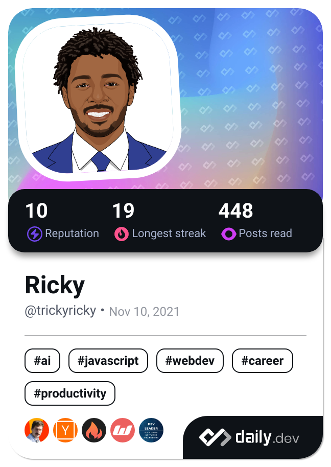

<h1 align="left">Richard Young</h1>

<!--   -->

<!--    --> 
  

  
Hi, I'm a Full Stack Engineer who is passionate about building scalable content for the web

:computer: Currently A FTE Software Engineer for Lowe's Home Improvement.

:page_facing_up: AWS Certified - Developer Associate. [Credentials](https://www.credly.com/badges/fe510d19-9cf2-45c4-970c-6cda19c88cdb/linked_in?t=sallok)

:writing_hand: I'm usually making updates for [Siphon Zone](https://github.com/TrickkyRicky/Siphon-Zone-Viewing) Mobile App.

### I'm currently working on

  
  
  

 

## 🧰 Languages and Tools

 
    

## 📊 Stats

  
  

